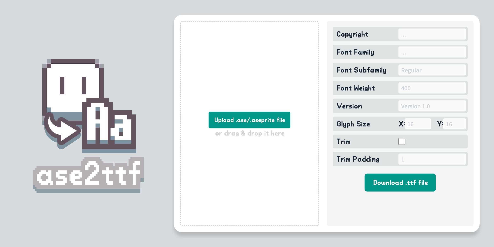
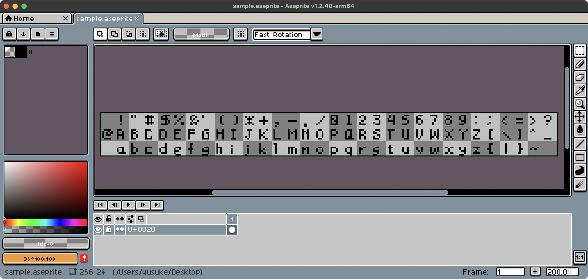
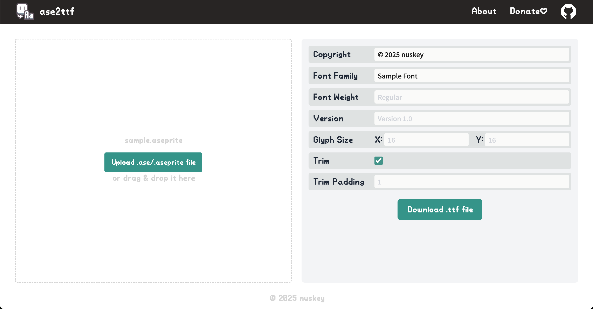

# ase2ttf
Create pixel font from Aseprite file



## Overview

ase2ttf is a tool for creating fonts from Aseprite files. With ase2ttf, you can easily create fonts without having to use complex font software.

This repository provides both the core logic for converting .aseprite files to .ttf and an open-source CLI tool for using ase2ttf from the command line.

## Usage

The Aseprite file to be converted into a font must meet the requirements specified by ase2ttf.



ase2ttf splits each layer into the specified glyph size and assigns Unicode characters in order from the top left. At this time, the starting code must be specified in the layer name starting with `U+` (e.g., `U+0020-`) as shown in the image. Layers with other names are ignored.



Next, upload the created .aseprite file and enter the required settings. From the settings screen, you can set information such as copyright and font name. You can also enable Trim to automatically trim the left and right whitespace. The character spacing in this case is specified by Trim Padding.

Once the settings are complete, press the "Download .ttf file" button to download the created font.

## CLI Tool

The CLI tool can be installed via cargo:

```bash
$ cargo install ase2ttf
```

Alternatively, you can use the executables distributed on the [Releases](https://github.com/nuskey8/ase2ttf/releases) page.

You can specify the path to the .aseprite file from the command line to create a .ttf file. The options are the same as those on the website.

```text
$ ase2ttf -h
Usage: ase2ttf [OPTIONS] <PATH>

Arguments:
  <PATH>  

Options:
  -o, --output <OUTPUT>              
      --copyright <COPYRIGHT>        
      --family <FAMILY>              
      --subfamily <SUBFAMILY>        
      --font-version <FONT_VERSION>  
      --font-weight=<FONT_WEIGHT>    
      --glyph-width=<GLYPH_WIDTH>    [default: 16]
      --glyph-height=<GLYPH_HEIGHT>  [default: 16]
      --trim                         
      --trim-pad=<TRIM_PAD>          [default: 1]
  -h, --help                         Print help
  -V, --version                      Print version
```

