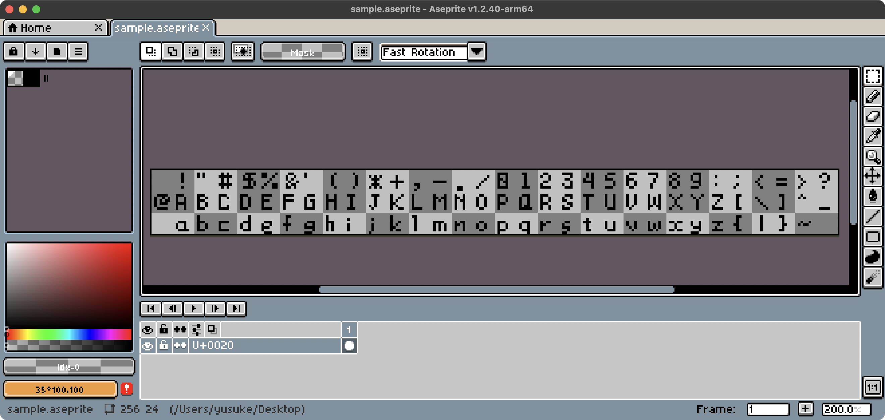
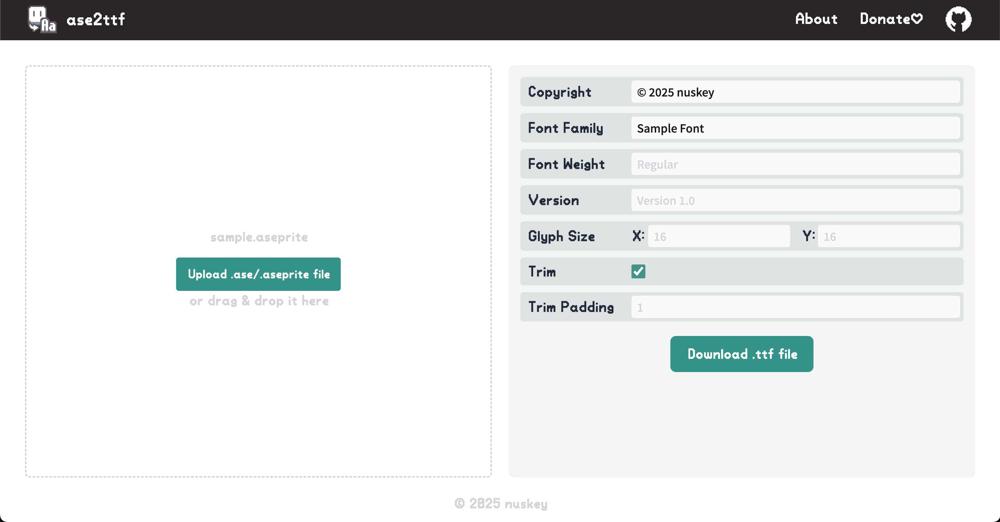

# ase2ttf
 Create pixel font from Aseprite file


## 概要

ase2ttfはAsepriteファイルからフォントを作成するためのツールです。ase2ttfを用いることで複雑なフォントソフトを触ることなく、簡単にフォントを作成することができます。

このリポジトリでは.asepriteから.ttfへの変換を行うコア部分と、コマンドラインでase2ttfを利用するためのCLIツールがオープンソースとして公開されています。

## 使い方

フォント化するAsepriteファイルは、ase2ttfが指定する要件に沿ったものである必要があります。



ase2ttfは各レイヤーを指定されたグリフサイズで分割し、左上から順にUnicodeを割り当てます。このとき、開始コードは画像のように`U+`から始まるレイヤー名（例：U+0020-）で指定する必要があります。それ以外の名前のレイヤーは無視されます。



次に、作成した.asepriteファイルをアップロードし、必要な設定を入力します。設定画面からは著作権やフォント名などの情報を設定することが可能です。また、Trimを有効化することで自動的に左右の空白をトリミングできます。このときの文字感覚はTrim Paddingで指定します。

設定が完了したら「Download .ttf file」ボタンを押して作成したフォントをダウンロードします。

## CLIツール

CLIツールはcargoからインストールすることが可能です。

```bash
$ cargo install ase2ttf
```

または[Releases](https://github.com/nuskey8/ase2ttf/releases)ページで配布されている実行ファイルが利用可能です。

コマンドラインから.asperiteファイルのパスを指定して.ttfファイルを作成できます。各オプションはサイトのものと同一です。

```text
$ ase2ttf -h
Usage: ase2ttf [OPTIONS] <PATH>

Arguments:
  <PATH>  

Options:
  -o, --output <OUTPUT>              
      --copyright <COPYRIGHT>        
      --family <FAMILY>              
      --subfamily <SUBFAMILY>        
      --font-version <FONT_VERSION>  
      --font-weight=<FONT_WEIGHT>    
      --glyph-width=<GLYPH_WIDTH>    [default: 16]
      --glyph-height=<GLYPH_HEIGHT>  [default: 16]
      --trim                         
      --trim-pad=<TRIM_PAD>          [default: 1]
  -h, --help                         Print help
  -V, --version                      Print version
```
